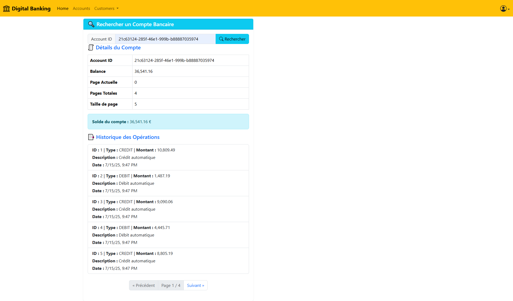

# 🔐 MonApp - Plateforme de gestion d’équipements

Bienvenue sur **MonApp**, une application Angular moderne et sécurisée permettant la gestion efficace des équipements.  
Elle propose une interface intuitive, un système d’authentification et une navigation responsive.

---

## 🚀 Fonctionnalités

- ✅ Authentification avec email et mot de passe
- 🔐 Protection des routes via AuthGuard
- 🧭 Navigation entre plusieurs pages (Accueil, Contact, Compteur, À propos)
- 💡 Persistance de session avec `localStorage`
- 📦 Architecture en composants standalone (Angular moderne)
- 🎯 Compteur interactif avec seuils visuels

---

## 📸 Aperçu

### 🔑 Page de connexion

### 🏠 Accueil

### 📞 Page de contact

### Search Account

### 🔟 Niveau avancé atteint

### ℹ️ À propos

---

## 🛠️ Technologies utilisées

- Angular 17+ (standalone components)
- TypeScript
- Bootstrap 5
- LocalStorage
- Angular Router / AuthGuard

---
